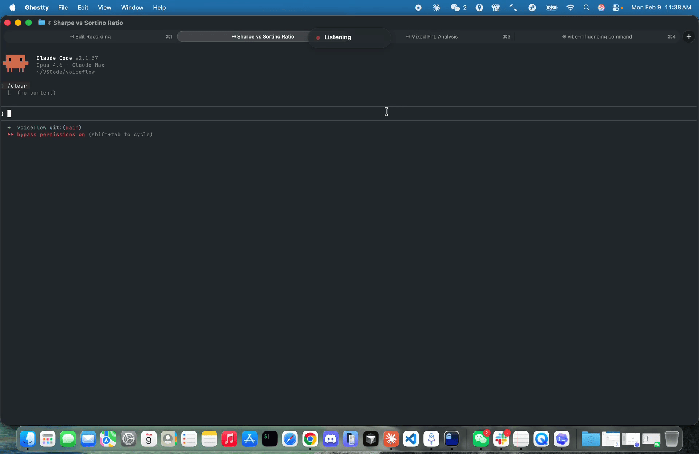

# Veery

**Dictation that speaks your language. All of them. Entirely on your Mac.**

You're a multilingual professional. You switch between Slack and WeChat all day, mixing English jargon into your native language mid-sentence. Every dictation app chokes on it. Veery was built for exactly that — entirely on your Mac, for free.



[](https://www.python.org/downloads/)
[-lightgrey.svg)](https://support.apple.com/en-us/116943)
[](LICENSE)
[](https://github.com/andyhcwang/veery)

## Table of Contents

- [The Problem](#the-problem)
- [How It Works](#how-it-works)
- [Features](#features)
- [Quick Start](#quick-start)
- [The Jargon System](#the-jargon-system)
- [Configuration](#configuration)
- [Comparison](#comparison)
- [Contributing](#contributing)

## The Problem

You say "让Claude帮我review一下这个PR，看看API的latency有没有改善" and your dictation app produces garbage. Apple Dictation forces you to pick one language. Wispr Flow and SuperWhisper don't understand that "Sharpe ratio" should stay in English, not become "夏普率". And every tool turns "PyTorch" into "pie torch" because their models have never seen your jargon.

Veery was built because no one else was going to build it.

## How It Works

```
Hold Right Cmd → Speak naturally in any language mix → Release → Text appears

Audio → STT → Jargon Correction → Filler Removal → Paste to active app
        ↓           ↓                    ↓
   SenseVoice    fuzzy+phonetic       strips "um",
   or Whisper    YAML matching        "嗯", "额"
```

- **Instant** — Text appears the moment you stop speaking
- **Accurate** — Powered by Whisper large-v3-turbo, near-human accuracy across languages
- **Free forever** — No subscription, no usage limits, no account
- **Private** — Runs entirely on your Mac. No audio ever leaves your machine.

## Features

- **Just hold and speak** — Hold Right Cmd, talk naturally in any mix of languages, release. Text appears wherever your cursor is.
- **Your jargon, preserved** — "PyTorch" stays "PyTorch", not "pie torch". Fuzzy + phonetic matching catches what STT models get wrong.
- **Gets smarter as you use it** — Edit a dictation or re-dictate, and Veery learns the correction. No manual configuration needed.
- **Knows your codebase** — Run `--mine ~/code` and Veery extracts class names, constants, and imports from your projects. Your jargon stays ahead of any model's training data.
- **Clean output, no editing** — Filler words ("um", "嗯", "那个") stripped automatically. What you get is ready to send.
- **Your data never leaves your Mac** — No cloud, no account, no telemetry. Models download once, then everything runs offline forever. Fully open source — read every line of code.

## Quick Start

### Prerequisites

- macOS 14+ (Sonoma) with Apple Silicon (M1/M2/M3/M4)
- Python 3.13+
- [uv](https://docs.astral.sh/uv/) package manager
- PortAudio (`brew install portaudio`)

### Install

```bash
git clone https://github.com/andyhcwang/veery.git
cd veery
bash install.sh   # checks prerequisites, installs deps
```

Or manually:

```bash
git clone https://github.com/andyhcwang/veery.git
cd veery
uv sync
```

### Run

```bash
uv run veery
```

On first launch, Veery will:
1. Guide you through granting **Accessibility**, **Microphone**, and **Input Monitoring** permissions
2. Download STT models (~200MB for SenseVoice, ~1.5GB for Whisper) with a progress bar -- you can start dictating with SenseVoice while Whisper downloads in the background
3. Show a microphone icon in your menubar when ready

> **Note:** First-time setup requires an internet connection to download models. After that, Veery works fully offline.

Hold **Right Cmd**, speak in whatever mix of languages comes naturally, release, and watch the text appear.

## The Jargon System

STT models are trained on general speech — they don't know your domain vocabulary. Veery fixes this with a three-layer correction system that runs in <1ms:

### 1. Exact matching

```yaml
# jargon/tech.yaml
terms:
  PyTorch:
    - pie torch
    - py torch
  DuckDB:
    - duck dee bee
    - duck DB
  Sharpe ratio:
    - sharp ratio
    - sharp issue
```

When the STT outputs "pie torch", Veery instantly corrects it to "PyTorch".

### 2. Fuzzy matching

Even if the STT output doesn't exactly match a variant, fuzzy matching (via [rapidfuzz](https://github.com/rapidfuzz/rapidfuzz)) catches close approximations. "pytorche" still matches "PyTorch". Threshold is tunable (default: 82/100).

### 3. Phonetic matching

For terms where the STT gets the sounds right but the spelling wrong, consonant-skeleton matching catches them. "NumPi" and "NumPy" share the same skeleton `nmp`, so Veery knows they're the same term.

### Adding your own terms

Create a YAML file in `jargon/`, add your terms with STT variants, and reference it in `config.yaml`. Or open jargon files directly from the Veery menubar under **Jargon Dictionaries**. See [CONTRIBUTING.md](CONTRIBUTING.md) for the full format.

### Community jargon packs

Pre-built packs ship for common domains: `ai_ml.yaml`, `devops_cloud.yaml`, `frontend.yaml`. Add them to your `config.yaml` under `jargon.dict_paths`. Want to contribute a pack for your domain? See [Contributing](#contributing).

## Configuration

Veery works out of the box with sensible defaults. To customize, edit `config.yaml` in the project root:

```yaml
# config.yaml
stt:
  backend: whisper          # "sensevoice" or "whisper" (default: whisper)

audio:
  max_duration_sec: 30.0    # Auto-stop after 30s

vad:
  threshold: 0.4            # Speech detection sensitivity (lower = more sensitive)
  silence_duration_sec: 2.0 # Seconds of silence before auto-stop

hotkey:
  key_combo: right_cmd      # Push-to-talk key
  mode: hold                # "hold" (push-to-talk) or "toggle" (press-to-toggle)

jargon:
  dict_paths:
    - jargon/tech.yaml
    - jargon/quant_finance.yaml
  fuzzy_threshold: 82       # Fuzzy match sensitivity (0-100)

output:
  cgevent_char_limit: 500   # Text shorter than this is typed character-by-character;
                            # longer text is pasted via clipboard

learning:
  enabled: true
  promotion_threshold: 3    # Corrections needed before auto-adding to dictionary
```

## Comparison

| | Veery | SuperWhisper | Wispr Flow | Apple Dictation |
|---|---|---|---|---|
| **Price** | Free forever | $8.49/mo | $10/mo | Free |
| **Privacy** | 100% local | Local | Local + cloud options | Cloud |
| **Multilingual** | Purpose-built | Multi-lang (generic) | Multi-lang (generic) | Single language only |
| **Jargon handling** | Fuzzy + phonetic + auto-learn | Find-and-replace | Auto-learn | None |
| **Chinese STT** | SenseVoice (SOTA Chinese) | Whisper (English-first) | Proprietary | Apple ASR |
| **Custom dictionaries** | YAML (open, editable) | Vocabulary hints | Manual add | None |
| **Codebase mining** | Yes (`--mine`) | No | No | No |
| **Open source** | Yes | No | No | No |

Veery doesn't compete on polish or mobile support. It wins on the axis that matters to you: **mixed-language technical speech with domain jargon**.

## Contributing

We welcome contributions, especially:

- **Jargon packs** -- Add terms for your domain (biotech, crypto, game dev, etc.)
- **Bug reports** -- Open an issue with your STT output and expected correction
- **STT improvements** -- New backend integrations, accuracy benchmarks

To submit a community jargon pack:

1. Create `jargon/community/your_domain.yaml` following the existing format
2. Include phonetic variants that STT models commonly produce
3. Open a PR

See [CONTRIBUTING.md](CONTRIBUTING.md) for full guidelines.

## Credits

Built by [Andy Wang](https://x.com/AndyThinkMode).

**Core dependencies:**
- [SenseVoice](https://github.com/FunAudioLLM/SenseVoice) -- Chinese-optimized STT by Alibaba DAMO Academy
- [mlx-whisper](https://github.com/ml-explore/mlx-examples) -- Whisper on Apple Silicon via MLX
- [Silero VAD](https://github.com/snakers4/silero-vad) -- Voice activity detection
- [rapidfuzz](https://github.com/rapidfuzz/rapidfuzz) -- Fuzzy string matching
- [rumps](https://github.com/jaredks/rumps) -- macOS menubar framework

## License

MIT
